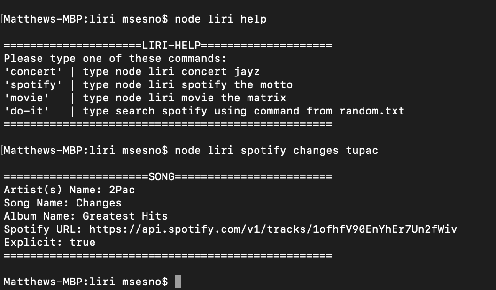

# Liri Bot
LIRI is smart search command line program that searches spotify, concerts and movie titles. It uses node.js and npm dotenv, moment, fs, axios, moment, and node-spotify-api to fetch queries to their api. It stores spotify key info in a .env file, and uses a gitignore to ignore node modules, .DS_Store, and .env files for data protection. Setup is a little tricky, steps outlined below. 

## Setup
- Navigate in your console to desired directory in console. 
- run ```git clone https://github.com/msesno/liri``` to clone repo
- run ```touch .env``` to create .env file 
- add this to .env file with your id/secret 
```
SPOTIFY_ID=yourSpotifyID
SPOTIFY_SECRET=yourSpotifySECRET
```
- run ```touch .gitignore``` to create .gitignore file 
- add this to your .gitignore file
```
node_modules
.DS_Store
.env
``` 
- run ```npm i dotenv``` to install env node package 
- run ```npm i fs``` to install file system node package 
- run ```npm i axios``` to install axios node package 
- run ```npm i moment``` to install moment node package 
- run ```npm i node-spotify-api``` to install env node package 

Congrats, you should now be ready to run the program! 


## Using Liri
Here are some sample commands once installed properly. 

- ```node liri help``` will return the help menu
- ```node liri concert``` will auto load an artist for bandisintown api
- ```node liri spotify``` will auto load a track to spotify api
- ```node liri movie``` will auto load a movie to omdb api
- ```node liri do-it``` will auto load external file track to spotify api

- ```node liri movie Nightmare Before Christmas``` will return movie data
- ```node liri spotify Tupac Changes``` will return song data
- ```node liri concert Red Hot Chili Peppers``` will return concert data

## Github 
https://github.com/msesno/liri

## Screenshot
